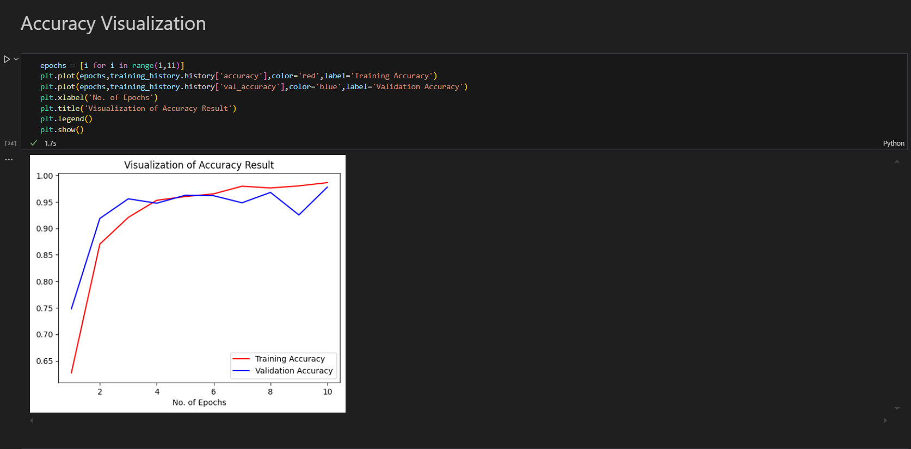
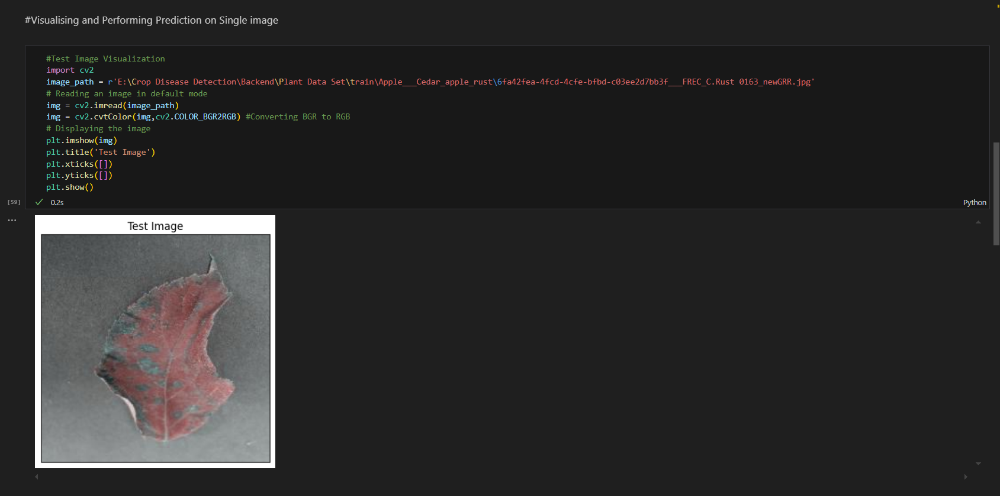

# AI Plant Disease Detection 🌿🤖
## Overview
AI Plant Disease Detection is an intelligent tool powered by machine learning to identify plant diseases from images. It's designed to help farmers, researchers, and agricultural organizations detect diseases at early stages, enhance crop management, and reduce agricultural losses.

## 🚀 Features

Automated Image Analysis: Detect diseases directly from leaf images.

High Accuracy: Trained with a vast dataset to ensure precise disease classification.

User-Friendly Interface: A simple input/output system to make it accessible to everyone.

Scalable Solution: Can be adapted to support more crops and diseases as the model improves.
## 🔧 Technologies Used

Programming Language: Python 🐍

Machine Learning Frameworks:
TensorFlow/Keras or PyTorch for model development 🧠

Image Processing Libraries:
OpenCV, PIL for handling and processing images 🌄

Dataset:
Publicly available datasets like PlantVillage or custom datasets 🌱

## 🛠 How It Works

Data Collection: Gathered images of healthy and diseased plant leaves.

Preprocessing: Includes resizing, normalization, and augmentation to improve model training.

Model Training: A Convolutional Neural Network (CNN) is trained to classify diseases.

Prediction: The trained model predicts the disease when fed a new leaf image.

Output: Displays the disease name and the confidence level.

## 💻 Usage

Upload an Image: Drag and drop or browse your file to upload a plant leaf image.

Disease Detection: The model will analyze the image and provide:

The detected disease.

Confidence level (accuracy of the prediction).

## Accuracy Visualization

## Test Image

## Disease Prediction

## 🔮 Future Enhancements

Mobile App Integration: Allow on-field usage with mobile apps for real-time detection 📱.

Expanded Dataset: Include more plant species and diseases for broader coverage 🌾.

Real-Time Video Detection: Enable live video feeds for disease detection 🌟.

## 📝 How to Contribute

We welcome contributions to make this project even better! You can help by:

Improving the model accuracy.

Adding more plant species or diseases to the dataset.

Fixing bugs and improving the interface.

Steps to Contribute:

Fork the repository 🍴

Clone your fork 🖥️

Create a new branch (git checkout -b feature-branch) 🏗️

Make your changes and commit 📝

Push to your branch (git push origin feature-branch) 🚀

Open a Pull Request (PR) 🔃

## 🌍 Acknowledgements

PlantVillage Dataset: A large public dataset for training models.

TensorFlow/Keras or PyTorch: For powerful machine learning capabilities.

OpenCV & PIL: For image processing tasks.
